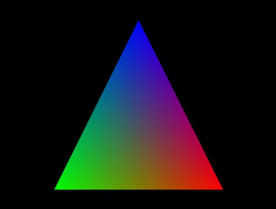
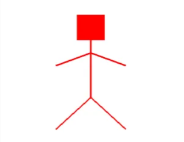

# Atividade

1. Faça programas separados que desenhe os seguintes objetos abaixo:
    1. Um triângulo 2D com a seguinte estrutura:
        
        
        
    2. Um boneco palito 2D:
        
        
        
    3. Uma bandeira de algum país do mundo.
